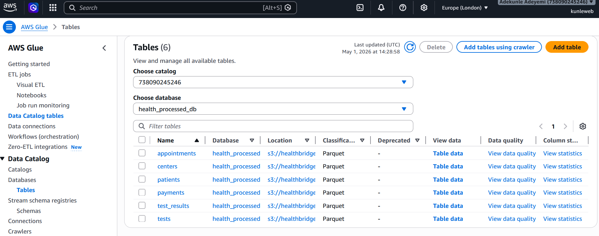
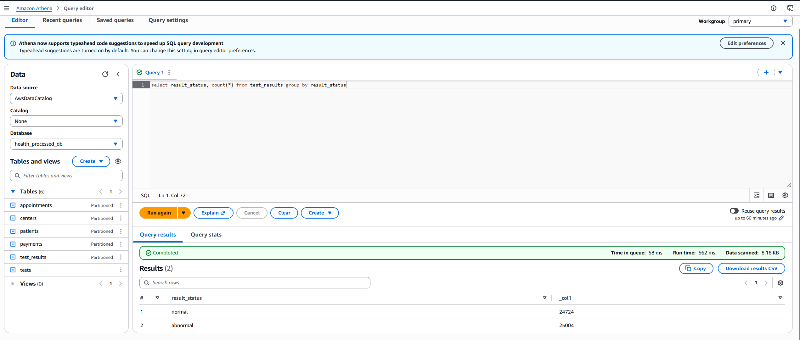

# HealthBridge Data Pipeline 

Data migration pipeline for ingesting healthcare records from a PostgreSQL database, and ingests into an Amazon S3, and makes them available for high-performance querying using Amazon Athena.
 

## Pipeline Architecture

The workflow is broken down into three main phases:

### 1. Data Extraction (Landing Layer)
Data is originally stored in a Supabase PostgreSQL database. A Python extraction script (`src/extractor.py`) connects to the database via SQLAlchemy and pulls records across several core tables (`appointments`, `centers`, `patients`, `payments`, `tests`, `test_results`). The raw data is written directly to an Amazon S3 landing zone (`s3://healthbridge-data-lake/landing/`) in CSV format using AWS Data Wrangler.

### 2. Transformation (Processed Layer)
Once the data lands in S3, an AWS Glue PySpark job (`scripts/glue_etl.py`) is executed to process the raw files. This script performs several automated cleaning and optimization tasks:
- **Deduplication & Cleaning:** Automatically drops null values on critical keys and removes duplicate rows based on table-specific primary keys (e.g., `appointment_id`, `patient_id`).
- **Data Type Enforcement:** Parses raw string dates into strict timestamp formats.
- **Partitioning:** Extracts the `year` and `month` from the transactional date columns and adds them as new partition columns.
- **Format Conversion:** Converts the bulky CSV files into highly-compressed Parquet files, writing them to the processed layer using Hive-style partitioning (`year=YYYY/month=MM`). 

### 3. Data Cataloging & Analytics
With the data cleaned and partitioned, an **AWS Glue Crawler** sweeps the processed S3 bucket to automatically infer schemas, recognize the Hive-style partitions, and build a unified AWS Glue Data Catalog.

Finally, the data is queried using **Amazon Athena**. Because the data is stored in Parquet format and partitioned by year and month, analytical queries run significantly faster and scan a fraction of the total data, dramatically reducing cloud compute costs.

  

## Local Setup & Configuration
- **.env**: Local environment variables require the `SUPABASE_URL` along with AWS credentials (`ACCESS_KEY`, `SECRET_KEY`, `REGION`) to run the initial extraction script.
- **AWS Glue**: The PySpark ETL job requires the `--s3_bucket` parameter and runs natively in AWS Glue Studio with standard IAM S3 permissions.
